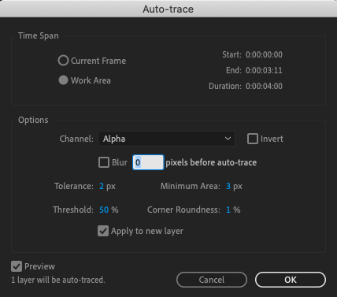
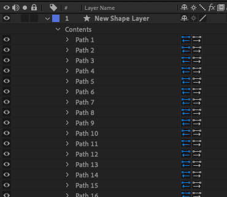
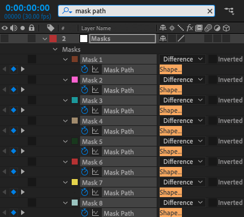
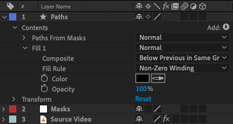

# CreateLottieLayer
This is a quick Adobe script based on the work of [Laird Kruger
](https://lairdkruger.com/) to generate [Lottie](https://lottiefiles.com/) friendly compositions in [Adobe After Effects](https://www.adobe.com/products/aftereffects.html). You can read more about Laird's explorations in his interactive write-up, [Advanced Lottie Animations](https://lottie-demonstration.webflow.io/).

## Running the Script
To run the `CreateLottieLayer` script, clone the repository or [copy the raw contents](https://raw.githubusercontent.com/samcraigdev/create-lottie-layer/main/CreateLottieLayer.jsx) to a file on your computer. After opening [Adobe After Effects](https://www.adobe.com/products/aftereffects.html) navigate to `File > Scripts > Run Script File`. Locate and select the script, and click `Open`. If you want to install the script, navigate to `File > Scripts > Install Script File`.

## Acknowledgments
- Laird Kruger's [Advanced Lottie Animations](https://lottie-demonstration.webflow.io/)
- smallpath's [AdobeColorPicker](https://github.com/smallpath/adobe-color-picker)

## License
This project is licensed under the MIT License - see the [LICENSE](LICENSE) file for details.
